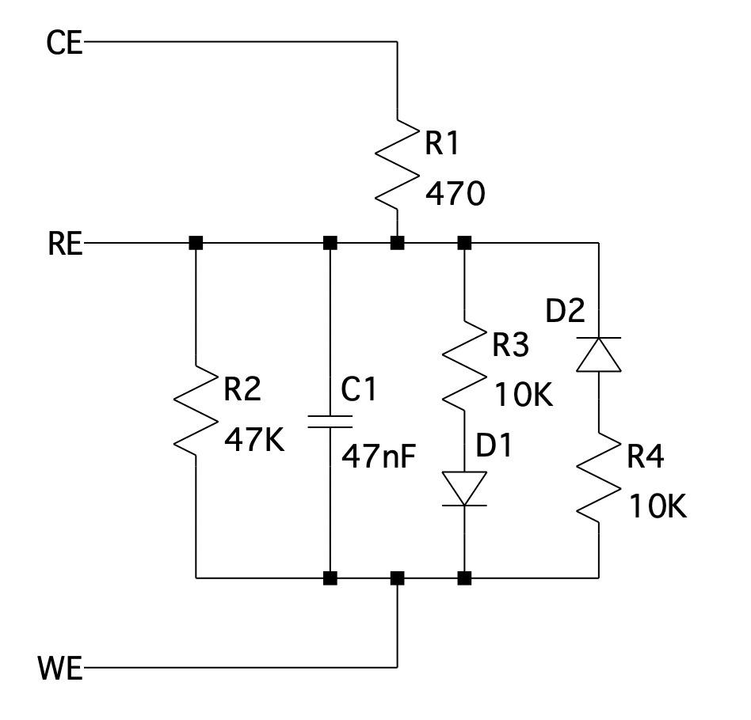

# Proyecto MASB-POT-S

## Introducción

Este proyecto ha consistido en la configuración y programación de un microcontrolador para poder realizar medidas electroquímicas, como la cronoamperometría y la voltametría cíclica de manera automática mediante un potenciostato. Se ha desarrollado con el objetivo de alcanzar y asentar todos los conocimiento vistos y trabajados en la asignatura de Microcontroladores para Aplicaciones y Sistemas Biomédicos. 

Las autoras de este trabajo son Bruna Martín Català y Maria Mor Basart (ver *Figura 1* y *Figura 2*).

## Tabla de contenidos 

1. Introducción 

   - Potenciostato 
   - Voltametría cíclica 
   - Cronoamperometría 
   - Git y GitHub

2. Objetivos 

3. Desarrollo del proyecto 

   - Flujo de trabajo de la voltametría cíclica

   - Flujo de trabajo de la cronoamperometría

4. Resultados

5. Conclusiones 

6. Referencias 

   

### Potenciostato

Este proyecto está basado en la programación de un potenciostato formado por un front-end y un back-end basado en la Evaluation Board (EVB) NUCLEO F401RE de STMicroelectronics. 

Un potenciostato es un dispositivo electrónico compuesto por tres electrodos, generalmente, y que se usa para medidas y experimento electroquímicos. 

El sistema consiste de tal manera que el electrodo de trabajo debe mantenerse a un potencial constante con respecto al electrodo de referencia mediante el ajuste de la corriente en el electrodo auxiliar [1]. Así pues, el potenciostato debe polarizar la celda electroquímica a una tensión Vcell y leer la corriente Icell que circula por esta. Para establecer la tensión Vcell, disponemos del DAC MCP4725, cuya dirección I2C es 1100000. Este modelo puede generar una tensión de salida de 0 a 4 V, pero se le ha añadido una etapa para convertir dicha señal a una bipolar de - 4 a 4 V para poder polarizar tanto a tensiones positivas como negativas [2]. 

El potenciostato usado para este proyecto puede verse representado en el siguiente esquema (ver *Figura 3*). 

**_Figura 3._** Esquema del potenciostato usado para este proyecto.

### Voltametría cíclica

La voltametría cíclica (CV) es una medida electroquímica donde se obtiene información sobre la corriente de un analito al modificarse el potencial. Estos estudios pretenden estudiar la reactividad en la semicelda de un analito controlando el potencial de un electrodo mientras se mide la corriente resultante [3]. 

Para ello se requiere de tres electrodos: 

- Electrodo de trabajo (WE): está en contacto con el analito e induce el potencial 
- Electrodo de referencia (RE): tiene un potencial conocido para poder medir la diferencia de potencial entre este y el WE.
- Electrodo auxiliar (CE): subministra la correinte necesaria para mantener WE constante. 

Esta medida se realiza mediante lo que denomina como barrido triangular, debido a que el potencial entre el WE y el RE va variando hasta alcanzar uno establecido y luego cambia de dirección, y así un número determinado de ciclos. A continuación se muestra un ejemplo de gráfica obtenido de una voltametría cíclica de la comparación de la redisolución de Sn en los electrodos modificados de Pt/Sn (ver *Figura 4*). 

### Cronoamperometría 

La cronoamperometría (CA) consiste en el estudio de la variación de la respuesta de la corriente con el tiempo en función del control de un potenciostato. 

El electrodo de trabajo, el cual está en contacto con el electrolito, se somete a un cambio constante de potencial desde un valor inicial a uno final durante un tiempo determinado [4]. 

La siguiente imagen muestra un ejemplo de una gráfica de una cronoamperometría en una solución de H 2 SO 4 /ACN/CuSO 4 (ver *Figura 5*).

Así pues, estas dos medidas electroquímicas son las que realizaremos sobre dos muestras de *ferricianuro de potasio* a concentraciones de 1mM y 5mM de *cloruro de potasio*. 

### Git y GitHub

Este proyecto está basado en el desarrollo de un código en equipo. Para ello existen algunas herramientas que pueden facilitar el control de versiones entre los miembros del equipo: Git y GitHub. 

Git es una herramienta de control de versiones de código muy potente y de software libre. Se puede mantener un historial completo de versiones y nos permite desplazarnos de una manera muy ágil por todas las revisiones de código. Además, tiene un sistema de trabajo con ramas que permite una correcta organización y la realización de proyectos que convergen en un proyecto principal, las cuales permiten testear códigos antes de juntarlos [5]. 

Para nuestro proyecto, se han desarrollado cuatro ramas: 

- `Develop`: donde se juntará todo el código final testeado 
- `feature/crono`: para la cronoamperometría
- `feature/volta`: para la voltametría 
- `feature/setup`: para configurar todos los pines iniciales. 

Aunque haya dos ramas para la cronoamperometría y la voltametría cíclica, cabe destacar que el código correcto y definitivo de ambas se hizo directamente en la rama `develop` por un fallo técnico.

En cuanto a GitHub, es una aplicación gratuita que permite gestionar repositorios Git y contiene una interfaz web para poder acceder y controlas fácilmente las diferentes versiones de código. 

## Objetivos 

Los objetivos de este proyecto son los siguientes:

- Programar un potenciostato portable.
- Controlar la Power Management Unit (PMU) del módulo front-end del potenciostato.
- Comunicarse con la aplicación viSens-S instalada con el host u ordenador mediante el protocolo MASB-COMM-S.
- Realizar una voltammetría cíclica.
- Realizar una cronoamperometría.

## Desarrollo del proyecto

### Flujo de trabajo de la voltametría cíclica

En la siguiente figura, podemos observar el flujo realizado que corresponde a la operativa del microcontrolador a la hora de realizar una voltametría cíclica. 

**_Figura 6._** Diagrama de flujo seguido para programar el microcontrolador cuando se realiza una voltametría cíclica.

A continuación se explicará con detalle las partes que no estan detalladas en la figura. En primer lugar, definimos y fijamos los valores de las siguientes variables:

- `tomarPunto_cv = TRUE`
- Hemos definido la resistencia `RTIA` de 10.000 Ω
- Fijamos la tensión de la celda `Vcell` a `eBegin` que obtenemos de la `cvConfiguration`.
- Fijamos `vObjetivo` a `eVertex1`
- Obtenemos el `eStep` y la `scanRate` de  la `cvConfiguration` y definimos el periodo entre muestras, dividiendo ambos parámetros.
- Definimos y inicializamos la variable `cycles` a 0.

Cerramos relé y, en caso de que el número de ciclos no haya superado al que está marcado en la `cvConfiguration` y que el _sampling period_ (periodo entre muestras) haya transcurrido, empezaremos las mediciones de la `Vcell` y la `Icell` y enviaremos los valores obtenidos al _host_.

Para empezar estas mediciones, hemos utilitzado la boolean `tomarPunto_CV` en un condicional if, de modo que si esta variable es `TRUE`, empezaremos estas mediciones. Justo después de el condicional cambiaremos el valor de la variable de `TRUE` a `FALSE`, que para hacer la próxima medición volverá a ser `TRUE` usando una de la funciones definidas al final del código de la cronoamperometría.  

Lo que hacemos a partir de ahora es un barrido triangular. Empezaremos aplicando una tensión `eBegin` a la celda e aplicaremos incrementos o decrementos de  `eStep` a esta tensión hasta llegar a la tensión de `eVertex1` y, una vez lleguemos a este, realizaremos lo mismo hasta que lleguemos al valor de `eVertex2`. Una vez lleguemos a este, haremos otro barrido hasta llegar a  `eBegin`. Todo este proceso corresponde a un ciclo, que deberemos repetir tantas veces como lo indique el `cycles` de la `cvConfiguration` .

### Flujo de trabajo de la cronoamperometría 

Para la cronoamperometría también debemos definir unas variables:

- `tomarPunto` = `FALSE`
- `RTIA` = 50.000 Ω
- Fijamos `Vcell` a `eDC` que obtenemos de la `caConfiguration` 
- Fijamos `sampling_period` y `measurement_time` a los mismos parámetros de `caConfiguration`.
- Definimos las variables `counter` y `point` y las incializamos a 0 y 1 respectivamente. 

En este caso cerramos el relé y tomamos una primera medida de `Vcell` e `Icell`, que posteriormente serán enviadas al *host*. 

A continuación, las variables `counter` y `point` sumarán el `sampling_period` y una unidad, respectivamente, dado que habremos tomado una muestra. Es decir, el `counter` indica el número de muestras y el `sampling_period` el tiempo que toma cada muestra. 

Una vez tomada la primera muestra muestra, en caso de que el `counter` no haya llegado al `measurement_time`, seguiremos tomando muestras, las cuales se irán enviando al *host*.  

Finalmente, cuando el *timer* llegue al `measurement_time`, ya habremos tomado todas las medidas y el relé se abrirá. 

A continuación se muestra un esquema del flujo de trabajo previamente explicado para un mayor entendimiento (ver Figura 7) .

***Figura 7***. Diagrama de flujo seguido para programar el microcontrolador cuando se realiza una cronoamperometría.

## Resultados 

En esta sección se muestran los resultados obtenidos al testear el proyecto en el potenciostato con dos muestras de *ferricianuro de potasio* a concentraciones de 1mM y 5mM de *cloruro de potasio*. 

Para ello, fuimos al laboratorio de Ingeniería Biomédica de la facultad de física de la Universidad de Barcelona, donde se nos cedió el potenciostato, un sensor y las disoluciones, y donde pudimos ensamblarlo todo (ver *Figura 8*).

***Figura 8.*** Potenciostato conectado con la muestra de la disolución en el sensor

Primero procedimos a realizar una voltametría cíclica usando el programa viSens-S, estableciendo los siguientes parámetros:

- E begin (V):
- E vertex 1 (V):
- E vertex 2 (V):
- Cycles:
- Scan rate (V/s):
- E step (V):

Por desgracia, la voltametría cíclica no funcionó. Solo se logró tomar una medida, lo cual es insuficiente. 

Seguidamente se realizó la cronoamperometría con el mismo programa y los siguientes valores:

- E DC (V): 0'15
- Sampling period (ms): 20 
- Measurement time (ms): 10

En esta ocasión sí que se logró visualizar los resultados, aunque para el caso de la muestra de concentración de un 1 mM de cloruro de potasio, los valores de corriente dieron inversos, como se puede ver en la siguiente imagen (ver *Figura 9*).

***Figura 9***. Cronoamperometría con disolución de 1 mM

En el caso de la siguiente muestra, los resultados son satisfactorios, como se puede observar en la siguiente gráfica (ver *Figura 10*).

***Figura 10***. Cronoamperometría con disolución de 5 mM

## Conclusiones

El potenciostato es un instrumento muy usado en experimentos electroquímicos y es clave en el mundo de la ingeniería biomédica para medir diferentes concentraciones de sustancias relevantes que permiten determinar el nivel de salud de un individuo. Este proyecto nos permite tener un primer contacto con la programación de un microcontrolador para este instrumento y, a la vez, nos permite aplicar los conocimientos obtenidos a lo largo de todas las prácticas realizadas en esta asignatura.

Considerando que el resto de prácticas trataban los diferentes aspectos de programar un microcontrolador de modo individual y esta práctica lo hace integrando una gran mayoría de ellas, este proyecto ha supuesto varias dificultades y complicaciones. Sobre todo al crear diferentes archivos con códigos para cada una de las funciones y hacerlos funcionar conjuntamente y también en el momento de compartir y modificar los archivos compartidos con la compañera usando github. 

A nivel de asignatura, 

## Referencias

